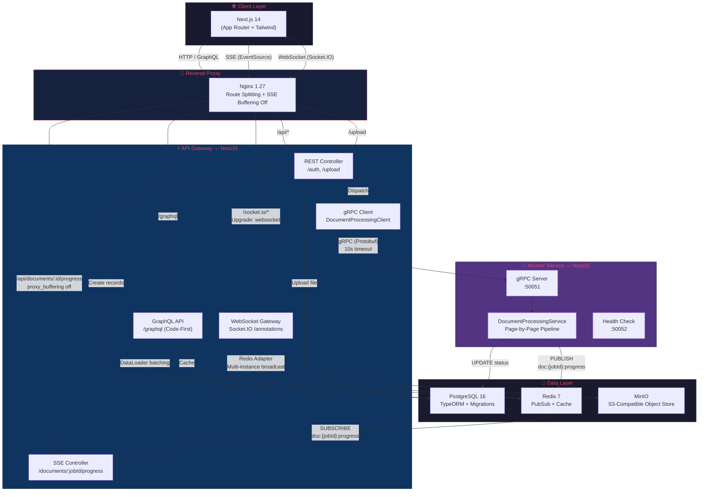
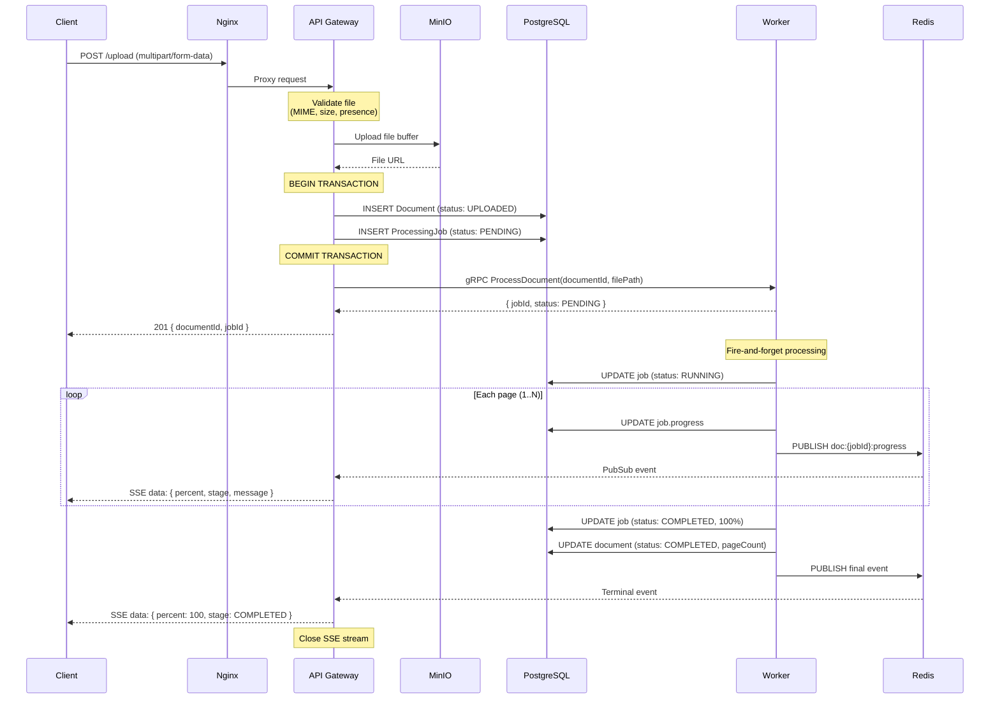
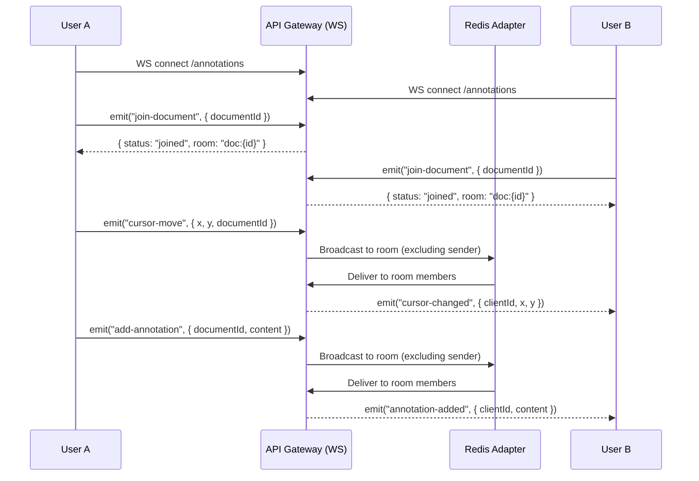
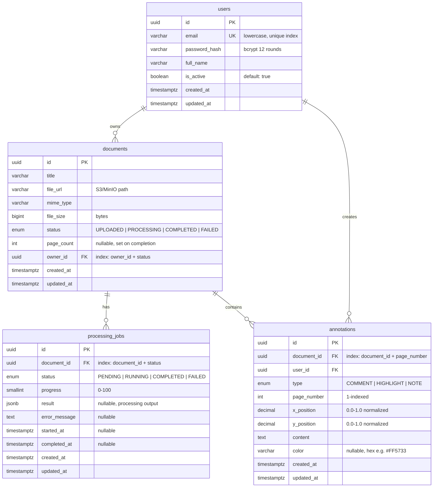

<p align="center">
  <h1 align="center">📄 DocFlow</h1>
  <p align="center">
    Real-time document processing platform — a portfolio project demonstrating<br/>
    production-grade microservices architecture with TypeScript.
  </p>
</p>

<p align="center">
  
  
  
  
  
  
  
  
</p>

---

## Table of Contents

- [Overview](#overview)
- [Architecture](#architecture)
  - [System Diagram](#system-diagram)
  - [Data Flow](#data-flow)
  - [Database Schema](#database-schema)
- [Tech Stack](#tech-stack)
- [Technical Decisions & Trade-offs](#technical-decisions--trade-offs)
- [Project Structure](#project-structure)
- [Quick Start](#quick-start)
  - [One-Command Startup (Docker)](#one-command-startup-docker)
  - [Local Development](#local-development)
- [API Reference](#api-reference)
- [Environment Variables](#environment-variables)
- [Scripts Reference](#scripts-reference)
- [License](#license)

---

## Overview

DocFlow is a **real-time document processing platform** built with a microservices architecture. Users upload documents, which are processed asynchronously by a worker service. Processing progress is streamed in real-time via Server-Sent Events. Collaborative document annotations are synchronized across clients via WebSocket.

**Key capabilities:**
- 📤 **Document Upload** — Validate, store in S3-compatible object storage (MinIO), persist metadata in PostgreSQL, dispatch processing via gRPC
- ⚡ **Real-time Progress** — Worker publishes page-by-page progress to Redis PubSub → API Gateway bridges to SSE → client renders a live progress bar
- 🤝 **Collaborative Annotations** — WebSocket gateway (Socket.IO) enables real-time cursor tracking and annotation sharing across connected clients
- 🔐 **JWT Authentication** — bcrypt password hashing, JWT-based stateless auth, guard-protected endpoints
- 📊 **GraphQL API** — Code-first schema with DataLoaders to prevent N+1 queries

---

## Architecture

### System Diagram



### Data Flow

#### Document Upload & Processing Flow



#### Real-time Annotations Flow



### Database Schema



---

## Tech Stack

| Layer | Technology | Why |
|---|---|---|
| **Frontend** | Next.js 14 (App Router), Apollo Client, Tailwind CSS | SSR for initial load, Apollo for GraphQL cache, Tailwind for rapid UI |
| **API Gateway** | NestJS, GraphQL (code-first), Socket.IO, SSE | Module system, decorator-driven, built-in DI, first-class WS/GQL support |
| **Worker** | NestJS, gRPC server | Same NestJS patterns, strong typing with Protobuf contracts |
| **IPC** | gRPC (Protocol Buffers) | Binary protocol, strict contracts, streaming support, codegen |
| **Database** | PostgreSQL 16, TypeORM | Transactional integrity, JSONB for flexible result storage, migrations |
| **Cache / PubSub** | Redis 7 | Sub-millisecond PubSub for progress streaming, Socket.IO adapter for multi-instance WS |
| **Object Storage** | MinIO (S3-compatible) | Local S3 clone — same API as AWS S3, zero cost for development |
| **Reverse Proxy** | Nginx 1.27 | Route splitting, WebSocket upgrade, SSE buffering control |
| **Containerization** | Docker, Docker Compose | Multi-stage builds, non-root users, health checks on every container |
| **Monorepo** | pnpm workspaces | Efficient disk usage, strict dependency isolation, workspace: protocol |

---

## Technical Decisions & Trade-offs

### 1. gRPC for Inter-Service Communication

| | Details |
|---|---|
| **Decision** | gRPC with Protocol Buffers for api-gateway → worker communication |
| **Why** | Strict contracts prevent API drift between services. Binary serialization is faster than JSON. Server-streaming RPC enables progress watching at the transport level. TypeScript interfaces are generated from `.proto` files, catching mismatches at compile time. |
| **Trade-off** | Higher initial setup cost vs. REST. Proto changes require regeneration. Browser-native gRPC requires grpc-web proxy (not needed here — gRPC is backend-only). |
| **Alternative rejected** | REST+JSON (no compile-time contracts) and message queues (unnecessary for request-reply patterns). |

### 2. SSE for Progress Streaming

| | Details |
|---|---|
| **Decision** | Server-Sent Events over dedicated REST endpoint (`GET /documents/:jobId/progress`) |
| **Why** | SSE is unidirectional (server→client), works with HTTP/1.1 and all reverse proxies, requires no WebSocket upgrade, auto-reconnects via `EventSource`. The progress stream is inherently one-way. |
| **Trade-off** | Limited to text/event-stream format. No client-to-server messages (unnecessary for progress). Keeping SSE connections alive through proxies requires heartbeat comments (implemented at 25s intervals). Maximum 6 concurrent connections per domain in HTTP/1.1 (mitigated by HTTP/2 in production). |
| **Alternative rejected** | WebSocket (overkill — bidirectional not needed), GraphQL Subscriptions (requires WS transport anyway, adds complexity for a simple stream). |

### 3. WebSocket / Socket.IO for Annotations

| | Details |
|---|---|
| **Decision** | Socket.IO WebSocket gateway with Redis adapter for collaborative annotations |
| **Why** | Bidirectional communication needed — users send cursor positions and annotations, receive others' updates in real-time. Socket.IO provides rooms (document-scoped broadcasts), automatic reconnection, and the Redis adapter enables horizontal scaling across multiple API Gateway instances without sticky sessions. |
| **Trade-off** | Socket.IO adds ~30KB client bundle. Its protocol is not raw WebSocket (proprietary framing), so it requires its own client library. The Redis adapter adds a Redis PubSub channel per connected socket. |
| **Alternative rejected** | Raw WebSocket (no rooms, no reconnection), long polling (high latency). |

### 4. Redis PubSub as Event Bridge

| | Details |
|---|---|
| **Decision** | Worker publishes progress events to Redis PubSub; API Gateway subscribes to the same channels for SSE delivery |
| **Why** | Decouples the worker from delivery mechanisms. The worker doesn't know (or care) whether progress is consumed via SSE, WebSocket, or gRPC streaming. New consumers can subscribe without modifying the worker. Fire-and-forget semantics match the "best-effort" nature of progress events — if no subscriber is listening, the event is simply dropped (DB is the source of truth). |
| **Trade-off** | PubSub is ephemeral — no message persistence. If the SSE client disconnects and reconnects, it misses events published during the gap. Mitigated by: (1) initial snapshot from DB on SSE connect, (2) client can poll the GraphQL API as fallback. |
| **Alternative rejected** | Redis Streams (persistent but more complex, unnecessary for ephemeral progress), Bull queues (designed for job processing, not fan-out). |

### 5. GraphQL (Code-First) with DataLoaders

| | Details |
|---|---|
| **Decision** | Apollo Server with NestJS code-first schema generation + request-scoped DataLoaders |
| **Why** | Clients query exactly the fields they need (dashboard needs `id+title+status`, detail page needs everything). Code-first means the schema is derived from TypeScript decorators — no separate `.graphql` files to keep in sync. DataLoaders batch `processingJobs` field resolution into a single SQL query per request, preventing N+1. |
| **Trade-off** | Higher complexity than REST for simple CRUD. Schema introspection must be disabled in production. DataLoaders must be request-scoped (new instance per request) to prevent data leakage between users. |
| **Alternative rejected** | REST (works but clients over-fetch), schema-first GraphQL (two sources of truth for types). |

### 6. Transactional Document + Job Creation

| | Details |
|---|---|
| **Decision** | Document and ProcessingJob records are created in a single PostgreSQL transaction |
| **Why** | Invariant: a document must always have at least one associated job after upload. Without a transaction, a crash between the two INSERTs would leave an orphaned document with no job, breaking the UI and API assumptions. |
| **Trade-off** | The MinIO upload happens *before* the transaction. If the transaction fails, the MinIO object is orphaned. Acceptable for a portfolio project; production would use a cleanup job or saga pattern. |

### 7. Non-Fatal gRPC Dispatch

| | Details |
|---|---|
| **Decision** | If the gRPC call to the worker fails, the document is still saved with `PENDING` status and the endpoint returns HTTP 202 (Accepted) |
| **Why** | The worker may be temporarily down (deployment, crash, network partition). The document and job are already persisted — a retry mechanism or manual re-trigger can start processing later. Failing the entire upload because the worker is unreachable would be a poor user experience. |
| **Trade-off** | Requires a mechanism to pick up `PENDING` jobs that were never dispatched (not yet implemented — flagged as a future enhancement). |

### 8. Multi-Stage Docker Builds

| | Details |
|---|---|
| **Decision** | Three-stage Dockerfiles (deps → build → production) with non-root user and in-image health checks |
| **Why** | Multi-stage builds minimize final image size (no devDependencies, no source code, no build tools). Non-root user follows the principle of least privilege. In-image `HEALTHCHECK` enables Docker Compose `depends_on: condition: service_healthy` for correct startup ordering. |
| **Trade-off** | Slightly longer first-build time due to separate stages. Debugging requires `docker exec` into the container (non-root user can't install tools). |

---

## Project Structure

```
docflow/
├── apps/
│   ├── api-gateway/               # NestJS — API orchestration layer
│   │   ├── Dockerfile             # Multi-stage build (builder → production)
│   │   └── src/
│   │       ├── app.module.ts      # Root module: Config, TypeORM, GraphQL, feature modules
│   │       ├── auth/              # JWT auth: register, login, guards, strategies
│   │       │   ├── auth.controller.ts
│   │       │   ├── auth.service.ts
│   │       │   ├── guards/        # JwtAuthGuard
│   │       │   ├── strategies/    # JWT Passport strategy
│   │       │   ├── decorators/    # @CurrentUser()
│   │       │   ├── dto/           # Register, Login, AuthResponse DTOs
│   │       │   ├── exceptions/    # EmailAlreadyExists, InvalidCredentials
│   │       │   └── interfaces/    # JwtPayload, AuthenticatedRequest
│   │       ├── documents/         # Document upload orchestration
│   │       │   ├── documents.controller.ts   # POST /upload (multipart)
│   │       │   ├── documents.service.ts      # Validate → MinIO → DB tx → gRPC
│   │       │   ├── annotations/              # WebSocket gateway
│   │       │   │   ├── annotations.gateway.ts  # Socket.IO: join, cursor, annotate
│   │       │   │   └── annotations.module.ts
│   │       │   ├── dto/
│   │       │   └── exceptions/
│   │       ├── graphql/           # GraphQL API layer
│   │       │   ├── graphql-api.module.ts
│   │       │   ├── graphql-api.service.ts
│   │       │   ├── resolvers/     # Document, ProcessingJob resolvers
│   │       │   ├── types/         # GraphQL object types (code-first)
│   │       │   ├── enums/         # GraphQL enum types
│   │       │   ├── guards/        # GqlJwtAuthGuard
│   │       │   ├── decorators/    # @GqlCurrentUser()
│   │       │   ├── loaders/       # DataLoaders (N+1 prevention)
│   │       │   └── exceptions/    # GraphQL-specific exceptions
│   │       ├── grpc/              # gRPC client to worker
│   │       │   ├── document-processing.client.ts  # Type-safe wrapper, 10s timeout
│   │       │   └── grpc-client.module.ts
│   │       ├── progress/          # SSE progress streaming
│   │       │   ├── progress.controller.ts    # GET /documents/:jobId/progress
│   │       │   ├── progress-sse.service.ts   # Redis PubSub → SSE bridge
│   │       │   └── interfaces/
│   │       ├── storage/           # MinIO/S3 integration
│   │       │   ├── storage.service.ts
│   │       │   └── storage.module.ts
│   │       └── health/            # Health check endpoint
│   │
│   ├── worker/                    # NestJS — Document processing service
│   │   ├── Dockerfile             # Multi-stage build, exposes :50051 + :50052
│   │   └── src/
│   │       ├── app.module.ts
│   │       ├── document-processing/
│   │       │   ├── document-processing.controller.ts  # gRPC method handlers
│   │       │   ├── document-processing.service.ts     # Processing pipeline + Redis publish
│   │       │   └── interfaces/
│   │       └── health/            # HTTP health check on :50052
│   │
│   └── web/                       # Next.js 14 — Frontend
│       ├── Dockerfile             # 3-stage: deps → build → standalone
│       ├── app/
│       │   ├── layout.tsx         # Root layout + ApolloProvider
│       │   ├── page.tsx           # Landing page
│       │   ├── login/             # Login page (SSR)
│       │   ├── dashboard/         # Document dashboard (SSR)
│       │   └── documents/[id]/    # Document workspace (SSR + real-time)
│       ├── components/
│       │   └── ProcessingProgress.tsx  # SSE-powered progress bar
│       ├── hooks/
│       │   ├── useProcessingProgress.ts  # EventSource hook
│       │   └── useDocumentAnnotations.ts # Socket.IO hook
│       ├── lib/
│       │   ├── apollo-client.ts   # Apollo Client singleton
│       │   └── server-api.ts      # Server-side API helper
│       └── providers/
│           └── ApolloProvider.tsx  # Client-side Apollo wrapper
│
├── libs/                          # Shared libraries (pnpm workspace packages)
│   ├── database/                  # @docflow/database
│   │   └── src/
│   │       ├── database.module.ts # DatabaseModule.forFeature()
│   │       ├── entities/          # User, Document, ProcessingJob, Annotation
│   │       ├── enums/             # DocumentStatus, ProcessingJobStatus, AnnotationType
│   │       ├── migrations/        # TypeORM migrations
│   │       └── seeds/             # Seed data
│   ├── proto/                     # @docflow/proto
│   │   └── src/
│   │       ├── document.proto     # Protobuf service definition
│   │       ├── interfaces.ts      # Generated TypeScript interfaces
│   │       └── grpc-exceptions.ts # Typed gRPC error classes
│   └── redis/                     # @docflow/redis
│       └── src/
│           ├── redis.module.ts    # RedisModule.register()
│           ├── redis-publisher.service.ts  # Publish JSON to channels
│           └── redis-subscriber.service.ts # Subscribe with Observable<T>
│
├── nginx/
│   └── nginx.conf                 # Route splitting, SSE/WS proxy rules
│
├── docker-compose.yml             # Development: Postgres, Redis, MinIO, PgAdmin
├── docker-compose.prod.yml        # Production: All services + Nginx
├── .env.example                   # All environment variables documented
├── pnpm-workspace.yaml            # Workspace packages
├── tsconfig.base.json             # Shared strict TypeScript config
└── package.json                   # Root scripts (dev, build, docker, migrations)
```

---

## Quick Start

### Prerequisites

- **Docker** ≥ 24 & **Docker Compose** ≥ 2.20
- **Node.js** ≥ 20 (for local development)
- **pnpm** ≥ 9 (for local development)

### One-Command Startup (Docker)

Start the **entire platform** — all services, databases, and reverse proxy — with a single command:

```bash
# 1. Clone the repository
git clone <repo-url> docflow && cd docflow

# 2. Create environment file
cp .env.example .env

# 3. Build and start everything
docker compose -f docker-compose.prod.yml up --build -d
```

That's it! The platform is now running:

| Service | URL | Description |
|---|---|---|
| 🌐 **Web App** | [http://localhost](http://localhost) | Next.js frontend (via Nginx) |
| 📡 **GraphQL Playground** | [http://localhost/graphql](http://localhost/graphql) | Interactive API explorer |
| 📊 **MinIO Console** | [http://localhost:9001](http://localhost:9001) | Object storage dashboard |

All services are behind Nginx on port 80. Check health status:

```bash
# All containers should be "healthy"
docker compose -f docker-compose.prod.yml ps
```

To stop everything:

```bash
docker compose -f docker-compose.prod.yml down
```

To stop and **delete all data** (volumes):

```bash
docker compose -f docker-compose.prod.yml down -v
```

### Local Development

For active development with hot-reload:

```bash
# 1. Clone & install
git clone <repo-url> docflow && cd docflow
cp .env.example .env
pnpm install

# 2. Start infrastructure (Postgres, Redis, MinIO, PgAdmin)
pnpm docker:up

# 3. Run database migrations
pnpm migration:run

# 4. (Optional) Seed sample data
pnpm seed

# 5. Start services in separate terminals:

# Terminal 1 — API Gateway (http://localhost:4000)
pnpm dev:api

# Terminal 2 — Worker (gRPC :50051, Health :50052)
pnpm dev:worker

# Terminal 3 — Web Client (http://localhost:3000)
pnpm dev:web
```

| Service | URL |
|---|---|
| 🌐 Web Client | http://localhost:3000 |
| 📡 GraphQL Playground | http://localhost:4000/graphql |
| 🗄️ PgAdmin | http://localhost:5050 |
| 📊 MinIO Console | http://localhost:9001 |

---

## API Reference

### REST Endpoints

| Method | Path | Auth | Description |
|---|---|---|---|
| `POST` | `/auth/register` | ❌ | Register a new user |
| `POST` | `/auth/login` | ❌ | Login, returns JWT |
| `GET` | `/auth/profile` | ✅ JWT | Get current user profile |
| `POST` | `/upload` | ✅ JWT | Upload document (multipart/form-data) |
| `GET` | `/documents/:jobId/progress` | ✅ JWT | SSE progress stream |
| `GET` | `/health` | ❌ | Health check |

### GraphQL Queries & Mutations

```graphql
# List all documents for the authenticated user
query {
  documents {
    id
    title
    status
    mimeType
    fileSize
    pageCount
    createdAt
    processingJobs {
      id
      status
      progress
    }
  }
}

# Get a single document
query {
  document(id: "uuid") {
    id
    title
    status
    fileUrl
    pageCount
  }
}

# Delete a document (cascades to jobs + annotations)
mutation {
  deleteDocument(id: "uuid") {
    success
    message
  }
}
```

### WebSocket Events (Socket.IO)

| Namespace | Event (Client → Server) | Event (Server → Client) | Payload |
|---|---|---|---|
| `/annotations` | `join-document` | — | `{ documentId }` |
| `/annotations` | `cursor-move` | `cursor-changed` | `{ documentId, x, y }` |
| `/annotations` | `add-annotation` | `annotation-added` | `{ documentId, content }` |

### SSE Event Format

```
id: 1
event: progress
data: {"jobId":"uuid","percent":42,"stage":"RUNNING","message":"Processing page 5 of 12","currentPage":5,"totalPages":12}

id: 2
event: progress
data: {"jobId":"uuid","percent":100,"stage":"COMPLETED","message":"Processing complete — 12 pages extracted"}
```

---

## Environment Variables

All environment variables are documented in [`.env.example`](.env.example). Key variables:

| Variable | Default | Description |
|---|---|---|
| `POSTGRES_HOST` | `localhost` | PostgreSQL host (`postgres` in Docker) |
| `POSTGRES_PORT` | `5432` | PostgreSQL port |
| `POSTGRES_USER` | `docflow` | Database user |
| `POSTGRES_PASSWORD` | `docflow_secret` | Database password |
| `POSTGRES_DB` | `docflow` | Database name |
| `REDIS_HOST` | `localhost` | Redis host (`redis` in Docker) |
| `REDIS_PORT` | `6379` | Redis port |
| `JWT_SECRET` | `change-me-...` | ⚠️ **Must change in production** (64+ chars) |
| `JWT_EXPIRATION` | `3600` | Token lifetime in seconds |
| `API_GATEWAY_PORT` | `4000` | API Gateway HTTP port |
| `WORKER_GRPC_HOST` | `localhost` | Worker gRPC host (`worker` in Docker) |
| `WORKER_GRPC_PORT` | `50051` | Worker gRPC port |
| `MINIO_ENDPOINT` | `localhost` | MinIO host (`minio` in Docker) |
| `MINIO_PORT` | `9000` | MinIO S3 API port |
| `MINIO_ACCESS_KEY` | `minioadmin` | MinIO access key |
| `MINIO_SECRET_KEY` | `minioadmin_secret` | MinIO secret key |
| `MINIO_BUCKET` | `docflow-documents` | S3 bucket name |
| `UPLOAD_MAX_FILE_SIZE_MB` | `50` | Maximum upload file size |

---

## Scripts Reference

| Command | Description |
|---|---|
| **Development** | |
| `pnpm dev:api` | Start API Gateway with hot-reload |
| `pnpm dev:worker` | Start Worker with hot-reload |
| `pnpm dev:web` | Start Next.js dev server |
| **Build** | |
| `pnpm build` | Build all packages |
| `pnpm build:api` | Build API Gateway only |
| `pnpm build:worker` | Build Worker only |
| `pnpm build:web` | Build Next.js for production |
| **Database** | |
| `pnpm migration:run` | Run pending migrations |
| `pnpm migration:generate` | Generate migration from entity changes |
| `pnpm migration:revert` | Revert last migration |
| `pnpm migration:show` | Show migration status |
| `pnpm seed` | Seed the database with sample data |
| **Docker** | |
| `pnpm docker:up` | Start dev infrastructure (Postgres, Redis, MinIO, PgAdmin) |
| `pnpm docker:down` | Stop dev infrastructure |
| `pnpm docker:logs` | Tail dev infrastructure logs |
| `pnpm docker:prod:build` | Build all production Docker images |
| `pnpm docker:prod:up` | Start full production stack |
| `pnpm docker:prod:down` | Stop full production stack |
| `pnpm docker:prod:logs` | Tail production logs |
| **Quality** | |
| `pnpm lint` | Lint all packages |
| `pnpm format` | Format all files with Prettier |
| `pnpm format:check` | Check formatting without writing |

---

## License

MIT
