# DocFlow

> Real-time document processing platform — a portfolio project demonstrating production-grade microservices architecture.

## Architecture

```mermaid
graph TB
    Client["🌐 Web Client<br/>Next.js 14"]

    subgraph API["API Gateway — NestJS"]
        GQL["GraphQL API"]
        SSE["SSE Stream"]
        WS["WebSocket Gateway"]
    end

    subgraph Worker["Worker Service — NestJS"]
        GRPC_S["gRPC Server"]
        Processor["Document Processor"]
    end

    subgraph Infra["Infrastructure"]
        PG["PostgreSQL 16"]
        Redis["Redis 7"]
    end

    Client -->|"GraphQL"| GQL
    Client -->|"SSE"| SSE
    Client -->|"WS"| WS

    GQL -->|"gRPC"| GRPC_S
    GRPC_S --> Processor

    Processor -->|"PubSub"| Redis
    Redis -->|"Subscribe"| SSE

    GQL --> PG
    Processor --> PG
    GQL --> Redis
```



## Tech Stack

| Layer           | Technology                             |
|-----------------|----------------------------------------|
| Web Client      | Next.js 14 (App Router), Apollo Client, Tailwind CSS |
| API Gateway     | NestJS, GraphQL (code-first), WebSocket, SSE |
| Worker          | NestJS, gRPC server, document processing |
| Database        | PostgreSQL 16 (TypeORM)                |
| Cache / PubSub  | Redis 7 (Bull queues + PubSub + cache) |
| IPC             | gRPC (api-gateway → worker)            |
| Contracts       | Protocol Buffers (shared via `libs/proto`) |

## Project Structure

```
docflow/
├── apps/
│   ├── api-gateway/    # NestJS — GraphQL, WebSocket, SSE, gRPC client
│   ├── worker/         # NestJS — gRPC server, document processing
│   └── web/            # Next.js 14 — frontend
├── libs/
│   └── proto/          # Protobuf definitions
├── docker-compose.yml  # Postgres, Redis, PgAdmin
├── pnpm-workspace.yaml
└── tsconfig.base.json
```

## Quick Start

### Prerequisites

- **Node.js** ≥ 20
- **pnpm** ≥ 9
- **Docker** & **Docker Compose**

### 1. Clone & Install

```bash
git clone <repo-url> docflow
cd docflow
cp .env.example .env
pnpm install
```

### 2. Start Infrastructure

```bash
pnpm docker:up
```

This starts PostgreSQL (`:5432`), Redis (`:6379`), and PgAdmin (`:5050`).

### 3. Start Services

```bash
# Terminal 1 — API Gateway
pnpm dev:api

# Terminal 2 — Worker
pnpm dev:worker

# Terminal 3 — Web
pnpm dev:web
```

### Services

| Service      | URL                          |
|-------------|------------------------------|
| Web         | http://localhost:3000         |
| API Gateway | http://localhost:4000/graphql |
| PgAdmin     | http://localhost:5050         |

## Scripts

| Command             | Description                          |
|---------------------|--------------------------------------|
| `pnpm dev:api`      | Start API Gateway in dev mode        |
| `pnpm dev:worker`   | Start Worker in dev mode             |
| `pnpm dev:web`      | Start Next.js in dev mode            |
| `pnpm build`        | Build all packages                   |
| `pnpm lint`         | Lint all packages                    |
| `pnpm docker:up`    | Start infra containers               |
| `pnpm docker:down`  | Stop infra containers                |
| `pnpm docker:logs`  | Tail infra container logs            |

## License

MIT
