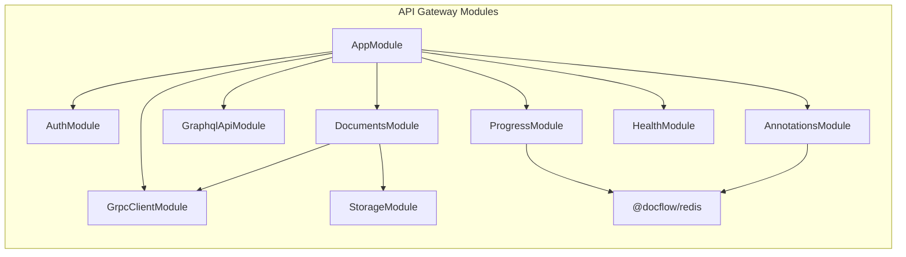
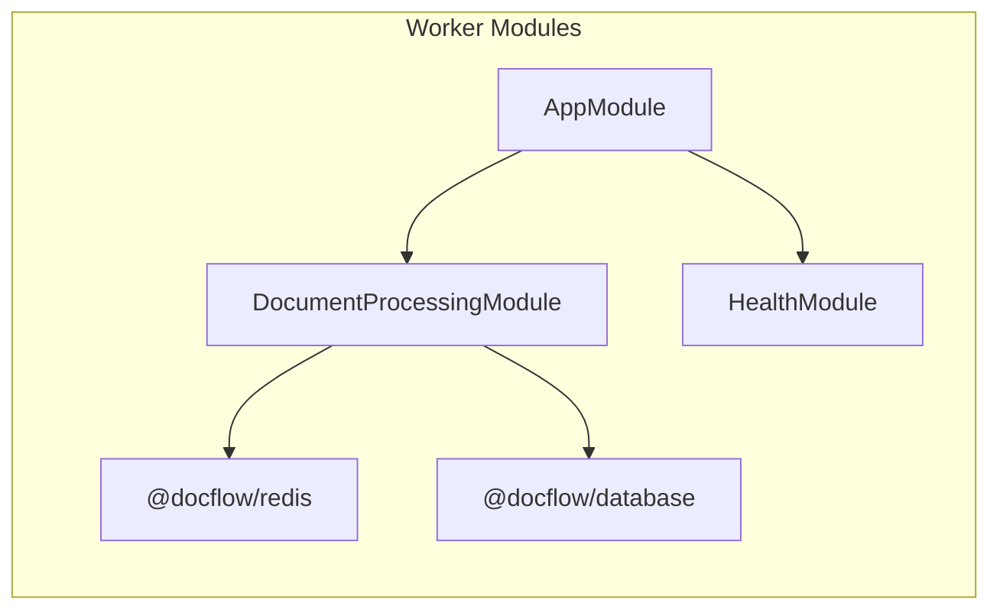
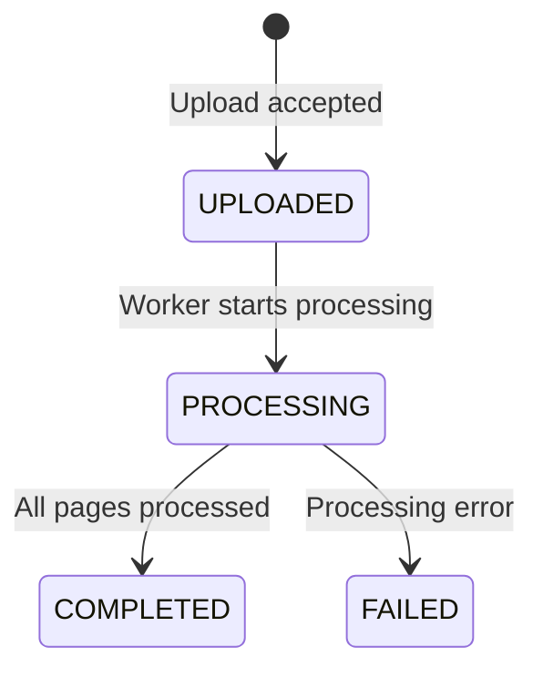
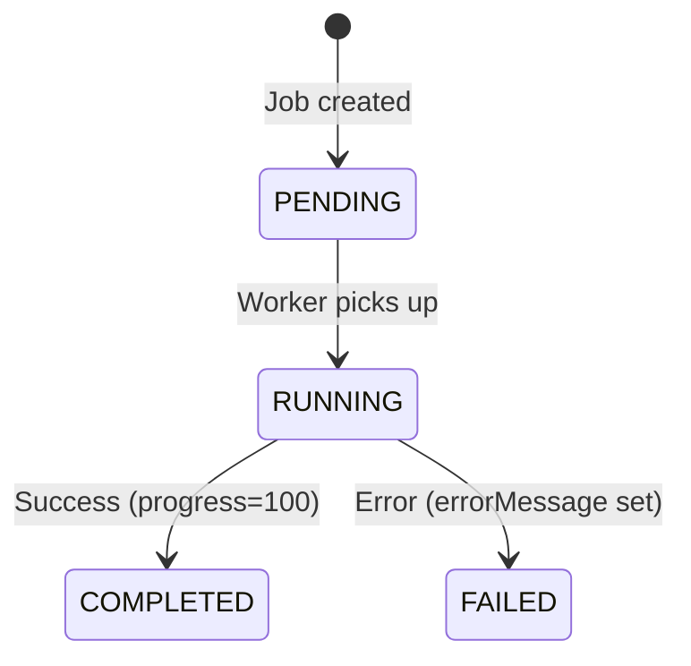

# DocFlow — Architecture Deep Dive

This document provides a detailed technical overview of DocFlow's architecture,
internal design decisions, and the rationale behind each component.

---

## Table of Contents

- [System Overview](#system-overview)
- [Service Architecture](#service-architecture)
  - [API Gateway](#api-gateway)
  - [Worker Service](#worker-service)
  - [Web Client](#web-client)
  - [Shared Libraries](#shared-libraries)
- [Communication Patterns](#communication-patterns)
  - [gRPC (API Gateway ↔ Worker)](#grpc-api-gateway--worker)
  - [Redis PubSub (Worker → API Gateway)](#redis-pubsub-worker--api-gateway)
  - [SSE (API Gateway → Client)](#sse-api-gateway--client)
  - [WebSocket (Client ↔ API Gateway)](#websocket-client--api-gateway)
  - [GraphQL (Client ↔ API Gateway)](#graphql-client--api-gateway)
- [Data Model](#data-model)
- [Error Handling Strategy](#error-handling-strategy)
- [Redis Key Conventions](#redis-key-conventions)
- [Security Model](#security-model)
- [Infrastructure & Deployment](#infrastructure--deployment)
- [Production Readiness Checklist](#production-readiness-checklist)

---

## System Overview

DocFlow follows a **microservices architecture** with two backend services and a frontend:

```
┌─────────────────────────────────────────────────────────────────┐
│                        Client Layer                             │
│  ┌───────────────────────────────────────────────────────────┐  │
│  │  Next.js 14 (App Router)                                 │  │
│  │  • Apollo Client (GraphQL)                               │  │
│  │  • EventSource (SSE progress)                            │  │
│  │  • Socket.IO Client (annotations)                        │  │
│  └───────────────────────┬───────────────────────────────────┘  │
│                          │ HTTP / WS / SSE                      │
├──────────────────────────┼──────────────────────────────────────┤
│                     Nginx Reverse Proxy                         │
│    /graphql → API GW  |  /api/* → API GW  |  / → Next.js       │
│    /socket.io → API GW (WS upgrade)                             │
│    /api/documents/*/progress → API GW (proxy_buffering off)     │
├──────────────────────────┼──────────────────────────────────────┤
│                    Backend Services                              │
│  ┌─────────────────────────────┐  ┌───────────────────────────┐ │
│  │  API Gateway (NestJS)       │  │  Worker (NestJS)          │ │
│  │  :4000 HTTP                 │  │  :50051 gRPC              │ │
│  │                             │  │  :50052 HTTP (health)     │ │
│  │  • REST: auth, upload       │  │                           │ │
│  │  • GraphQL: queries/muts    │──│──• gRPC server            │ │
│  │  • SSE: progress stream     │  │  • Document processor     │ │
│  │  • WS: annotations         │  │  • Redis publisher        │ │
│  └──────────┬──────────────────┘  └──────────┬────────────────┘ │
│             │                                │                   │
├─────────────┼────────────────────────────────┼───────────────────┤
│                       Data Layer                                 │
│  ┌──────────────┐  ┌──────────────┐  ┌──────────────────────┐   │
│  │ PostgreSQL 16│  │ Redis 7      │  │ MinIO (S3)           │   │
│  │ • TypeORM    │  │ • PubSub     │  │ • Document storage   │   │
│  │ • Migrations │  │ • WS Adapter │  │ • S3-compatible API  │   │
│  └──────────────┘  └──────────────┘  └──────────────────────┘   │
└─────────────────────────────────────────────────────────────────┘
```

**Design principles:**

1. **Separation of concerns** — Each service owns a single domain: the API Gateway handles client communication and orchestration; the Worker handles processing logic.
2. **Loose coupling** — Services communicate through contracts (Protobuf) and events (Redis PubSub), never through shared databases instances or direct imports.
3. **Shared nothing** — Both services connect to the same PostgreSQL database but through independent ORM configurations. Schema changes are managed through shared entity definitions in `@docflow/database`.

---

## Service Architecture

### API Gateway

The API Gateway is the **single entry point** for all client communication. It orchestrates between the client, databases, object storage, and the worker.



**Module responsibilities:**

| Module | Responsibility |
|---|---|
| `AuthModule` | Registration, login, JWT generation, Passport strategy, guards |
| `DocumentsModule` | File upload orchestration: validate → MinIO → DB tx → gRPC dispatch |
| `GraphqlApiModule` | Code-first GraphQL schema, resolvers, DataLoaders |
| `ProgressModule` | SSE endpoint: Redis PubSub subscription → text/event-stream |
| `AnnotationsModule` | Socket.IO WebSocket gateway for real-time cursor/annotation sync |
| `GrpcClientModule` | gRPC client connection to worker, type-safe wrapper with timeout |
| `StorageModule` | MinIO/S3 upload abstraction |
| `HealthModule` | `/health` endpoint for Docker health checks |

**Key implementation details:**

- **TypeORM** is configured with `synchronize: false` — schema changes are exclusively through migrations
- **ConfigModule** is global — all modules access environment variables through `ConfigService`, never through `process.env`
- **GraphQL** uses auto-generated schema (`autoSchemaFile: true`) — no separate `.graphql` files

### Worker Service

The Worker is a **headless gRPC server** that processes documents. It has no REST API endpoints except a health check.



**Processing pipeline:**

```
processDocument(request)           ← Unary gRPC call
  ├── Validate document exists
  ├── Guard against duplicate RUNNING jobs
  ├── INSERT ProcessingJob (PENDING)
  ├── UPDATE Document (PROCESSING)
  ├── Return { jobId } immediately  ← gRPC response
  └── startProcessing(jobId)        ← fire-and-forget background task
        ├── UPDATE job → RUNNING
        ├── PUBLISH start event
        ├── FOR page 1..N:
        │     ├── sleep(400ms)       ← simulated processing
        │     ├── UPDATE job.progress in DB
        │     └── PUBLISH progress event to Redis
        ├── UPDATE job → COMPLETED (100%)
        ├── UPDATE document → COMPLETED, pageCount
        └── PUBLISH completion event
```

**Design choice: fire-and-forget**

The `processDocument()` gRPC handler returns the job ID _immediately_ without waiting for processing to complete. `startProcessing()` runs asynchronously in the background. This means:

- The gRPC call is fast (< 100ms)
- The client can start listening for SSE progress events right after receiving the job ID
- If `startProcessing()` crashes, the error is logged and the job remains in DB with a stale status (a job recovery mechanism would be the next Production enhancement)

### Web Client

Next.js 14 with the App Router, Apollo Client for GraphQL, and Tailwind CSS for styling.

**Key pages:**

| Page | SSR | Real-time |
|---|---|---|
| `/login` | ✅ Server-side render | ❌ |
| `/dashboard` | ✅ Server-side fetch document list | ❌ |
| `/documents/[id]` | ✅ Server-side fetch document details | ✅ SSE progress + WS annotations |

**SSR + Real-time pattern:**

The `/documents/[id]` page demonstrates a production-grade pattern:
1. Server-side: Fetch document details and initial processing status via `server-api.ts`
2. Client-side: If the job is still running, `useProcessingProgress` hook opens an `EventSource` to stream live updates
3. Client-side: `useDocumentAnnotations` hook connects Socket.IO for collaborative annotations

This means the page has meaningful content on first paint (SEO-friendly, fast LCP), and seamlessly transitions to real-time mode on the client.

### Shared Libraries

All shared packages are in the `libs/` directory and published to the pnpm workspace:

| Package | Import | Contents |
|---|---|---|
| `@docflow/database` | `from '@docflow/database'` | TypeORM entities, enums, migrations, `DatabaseModule.forFeature()` |
| `@docflow/proto` | `from '@docflow/proto'` | Protobuf definitions, generated TS interfaces, gRPC exception classes |
| `@docflow/redis` | `from '@docflow/redis'` | Redis module, publisher service, subscriber service (Observable-based) |

**Dependency rule:** Application services (`apps/*`) may depend on libraries (`libs/*`), but never vice versa. Libraries must never depend on each other unless explicitly designed to.

---

## Communication Patterns

### gRPC (API Gateway ↔ Worker)

**Protocol:** HTTP/2, Protocol Buffers v3

**Contract (`libs/proto/src/document.proto`):**

```protobuf
service DocumentProcessingService {
  rpc ProcessDocument (ProcessDocumentRequest) returns (ProcessDocumentResponse);
  rpc GetProgress (GetProgressRequest) returns (stream ProgressUpdate);
}
```

**Client implementation (`DocumentProcessingClient`):**

- Uses NestJS `ClientGrpc` with `@nestjs/microservices`
- Resolves the gRPC service interface in `onModuleInit()` (app startup)
- `processDocument()` converts Observable → Promise with `lastValueFrom()` and applies a **10-second timeout** to prevent hanging on unreachable worker
- `getProgress()` returns an `Observable<ProgressUpdate>` for server-streaming RPCs

**Error handling:**

- gRPC errors are typed via custom exception classes (`GrpcNotFoundException`, `GrpcInvalidArgumentException`, `GrpcInternalException`)
- These map to standard gRPC status codes (`NOT_FOUND`, `INVALID_ARGUMENT`, `INTERNAL`)
- The API Gateway translates gRPC errors to HTTP/GraphQL errors at the boundary

### Redis PubSub (Worker → API Gateway)

**Pattern:** Publish/Subscribe (ephemeral, fire-and-forget)

**Channel naming:** `doc:{jobId}:progress`

**Payload (ProgressEvent):**

```typescript
interface ProgressEvent {
  jobId: string;
  documentId: string;
  status: 'RUNNING' | 'COMPLETED' | 'FAILED';
  progress: number;        // 0–100
  message: string;         // Human-readable status
  currentPage: number;
  totalPages: number;
  errorMessage?: string;   // Only on FAILED
  publishedAt: string;     // ISO 8601
}
```

**Publisher (Worker):** `RedisPublisherService.publish(channel, event)` — JSON-serializes the payload and publishes to the channel. Returns the number of active subscribers.

**Subscriber (API Gateway):** `RedisSubscriberService.subscribeJson<T>(channel)` — returns an `Observable<T>` that emits parsed JSON messages. The subscription creates a dedicated Redis connection (ioredis requirement for subscribers).

**Why PubSub and not Streams?**

Redis PubSub is **ephemeral** — if no subscriber is listening, the message is dropped. This is acceptable because:
- The **database is the source of truth**, not Redis
- When a client connects to SSE, the first event is an **initial snapshot from PostgreSQL**
- PubSub has lower overhead than Streams (no storage, no consumer groups)
- For this use case, we need fan-out (multiple SSE connections watching the same job) — PubSub does this natively

### SSE (API Gateway → Client)

**Endpoint:** `GET /documents/:jobId/progress`

**Implementation (`ProgressSseService`):**

The SSE service manages a complete lifecycle per connection:

```
1. VALIDATE    → Query PostgreSQL for the job (404 if absent)
2. SNAPSHOT    → Emit current DB state as first SSE frame
3. SUBSCRIBE   → Open Redis PubSub subscription
4. STREAM      → Map ProgressEvent → SseProgressPayload, write SSE frames
5. HEARTBEAT   → Send `: heartbeat\n\n` every 25s (proxy keepalive)
6. TIMEOUT     → Force-close after 5 min (resource leak prevention)
7. CLEANUP     → Deterministic teardown (timers, Redis sub, HTTP response)
```

**StreamContext** encapsulates all mutable state for a single connection, ensuring cleanup is deterministic and safe to call multiple times (idempotent via `closed` flag).

**Wire format:**

```
retry: 3000\n\n

id: 1
event: progress
data: {"jobId":"...","percent":42,"stage":"RUNNING","message":"Processing page 5 of 12"}

: heartbeat

id: 2
event: progress
data: {"jobId":"...","percent":100,"stage":"COMPLETED","message":"Processing complete"}
```

### WebSocket (Client ↔ API Gateway)

**Transport:** Socket.IO 4.x over WebSocket

**Namespace:** `/annotations`

**Room model:** Each document has a room `doc:{documentId}`. Clients join a room to receive updates scoped to that document.

**Events:**

| Direction | Event | Payload |
|---|---|---|
| Client → Server | `join-document` | `{ documentId: string }` |
| Client → Server | `cursor-move` | `{ documentId, x, y }` |
| Server → Client | `cursor-changed` | `{ clientId, x, y }` |
| Client → Server | `add-annotation` | `{ documentId, content }` |
| Server → Client | `annotation-added` | `{ clientId, documentId, content }` |

**Broadcasting:** `client.broadcast.to(room)` sends to all clients in the room **except the sender**, avoiding echo effects.

**Multi-instance support:** The Socket.IO Redis Adapter enables broadcasting across multiple API Gateway instances without sticky sessions.

### GraphQL (Client ↔ API Gateway)

**Approach:** Code-first (schema generated from TypeScript decorators)

**N+1 prevention:**

The `processingJobs` field on `DocumentType` is resolved via `ProcessingJobLoader`, which batches all document IDs in a single request into one SQL query:

```sql
-- Instead of N separate queries:
-- SELECT * FROM processing_jobs WHERE document_id = 'uuid1'
-- SELECT * FROM processing_jobs WHERE document_id = 'uuid2'

-- DataLoader batches into:
SELECT * FROM processing_jobs WHERE document_id IN ('uuid1', 'uuid2', ...)
```

The DataLoader is **request-scoped** to prevent cross-user data leakage.

---

## Data Model

### Entity Relationships

```
User (1) ──── (N) Document (1) ──── (N) ProcessingJob
  │                    │
  │                    └──── (N) Annotation
  │                                 │
  └─────────────────────────────────┘
```

### Status State Machines

**Document Status:**



**ProcessingJob Status:**



### Invariants

1. A Document always has at least one ProcessingJob after upload (enforced by DB transaction)
2. Only one ProcessingJob per Document can be in `RUNNING` state (enforced by application logic, not DB constraint)
3. `pageCount` is set only upon `COMPLETED` status
4. `startedAt` is set only when transitioning to `RUNNING`
5. `completedAt` is set only when transitioning to `COMPLETED` or `FAILED`
6. Deleting a User cascades to their Documents, which cascade to ProcessingJobs and Annotations

---

## Error Handling Strategy

### Layered Exception Classes

Each layer has its own exception hierarchy:

```
HTTP Layer (API Gateway REST)
├── MissingFileException          → 400 Bad Request
├── InvalidMimeTypeException      → 400 Bad Request
├── FileTooLargeException         → 413 Payload Too Large
├── EmailAlreadyExistsException   → 409 Conflict
├── InvalidCredentialsException   → 401 Unauthorized
├── DocumentCreationException     → 500 Internal Server Error
├── GrpcDispatchException         → 202 Accepted (non-fatal)
└── StorageUploadException        → 502 Bad Gateway

GraphQL Layer
├── GraphqlDocumentNotFoundException    → GraphQL error with NOT_FOUND code
├── GraphqlUnauthorizedException        → GraphQL error with UNAUTHENTICATED code
└── GraphqlForbiddenException           → GraphQL error with FORBIDDEN code

gRPC Layer (Worker)
├── GrpcNotFoundException          → gRPC NOT_FOUND (5)
├── GrpcInvalidArgumentException   → gRPC INVALID_ARGUMENT (3)
└── GrpcInternalException          → gRPC INTERNAL (13)
```

### Error Handling Rules

1. **Never throw raw `Error` objects** — always use typed exception classes
2. **Never swallow errors silently** — always log, then rethrow or handle explicitly
3. **Error messages in production must be vague** for auth endpoints (prevent user enumeration)
4. **gRPC dispatch failure is non-fatal** — returns 202, not 500
5. **Redis publish failure is non-fatal** — logged as warning, processing continues (DB is source of truth)
6. **Critical failures in error paths are double-logged** — e.g., failing to persist `FAILED` status in the DB

---

## Redis Key Conventions

All Redis keys follow the pattern: `{domain}:{id}:{type}`

| Key Pattern | Type | Usage |
|---|---|---|
| `doc:{jobId}:progress` | PubSub Channel | Worker publishes progress events, API Gateway subscribes for SSE delivery |

This convention enables:
- Easy debugging with `redis-cli MONITOR`
- Simple pattern-based key scanning (`doc:*:progress`)
- Namespace collision prevention between different domains

---

## Security Model

### Authentication Flow

```
Client → POST /auth/login { email, password }
       ← 200 { accessToken, expiresIn }

Client → GET /graphql (Authorization: Bearer <token>)
       → JWT verified by Passport JwtStrategy
       → User ID extracted from token payload
       → Injected via @CurrentUser() / @GqlCurrentUser()
```

### Security Measures

| Measure | Implementation |
|---|---|
| Password storage | bcrypt with 12 salt rounds |
| Timing attack prevention | `bcrypt.hash()` called even when user not found (constant-time response) |
| Token format | JWT with `{ sub: userId, email }` payload |
| Token expiration | Configurable via `JWT_EXPIRATION` (default: 1 hour) |
| Route protection | `JwtAuthGuard` (REST), `GqlJwtAuthGuard` (GraphQL) |
| Docker security | Non-root user (`docflow:1001`) in all containers |
| CORS | Configurable origin via `API_GATEWAY_CORS_ORIGIN` |
| Upload validation | MIME type whitelist, configurable max file size |
| SQL injection | Prevented by TypeORM parameterized queries |

---

## Infrastructure & Deployment

### Docker Compose Configurations

| File | Purpose | Services |
|---|---|---|
| `docker-compose.yml` | Development infrastructure | Postgres, Redis, MinIO, PgAdmin |
| `docker-compose.prod.yml` | Full production stack | All of the above + API Gateway, Worker, Web, Nginx |

### Container Health Checks

Every container has a health check:

| Container | Health Check | Interval |
|---|---|---|
| PostgreSQL | `pg_isready -U docflow` | 10s |
| Redis | `redis-cli ping` | 10s |
| MinIO | `curl http://localhost:9000/minio/health/live` | 10s |
| API Gateway | `wget http://localhost:4000/health` | 30s |
| Worker | `wget http://localhost:50052/health` | 30s |
| Web | `wget http://localhost:3000` | 30s |
| Nginx | `wget http://localhost:80` | 30s |

### Startup Ordering

Docker Compose `depends_on` with `condition: service_healthy` ensures correct startup:

```
PostgreSQL ──┐
Redis ───────┤
MinIO ───────┼──→ API Gateway ──→ Web ──→ Nginx
             └──→ Worker
```

### Nginx Configuration

Nginx acts as a reverse proxy with route-specific behavior:

| Route | Upstream | Special Config |
|---|---|---|
| `/graphql` | `api-gateway:4000` | WebSocket upgrade (for subscriptions) |
| `/api/*` | `api-gateway:4000` | Standard proxy |
| `/api/documents/*/progress` | `api-gateway:4000` | `proxy_buffering off`, 1h read timeout (SSE) |
| `/socket.io/*` | `api-gateway:4000` | WebSocket upgrade |
| `/upload` | `api-gateway:4000` | `proxy_request_buffering off` (streaming uploads) |
| `/` | `web:3000` | Catch-all, includes HMR WebSocket upgrade |

---

## Production Readiness Checklist

| Category | Status | Notes |
|---|---|---|
| **Security** | | |
| JWT authentication | ✅ | bcrypt + JWT with configurable expiration |
| Non-root Docker user | ✅ | UID 1001 in all containers |
| CORS configuration | ✅ | Configurable via env var |
| Input validation | ✅ | class-validator DTOs, file MIME/size checks |
| SQL injection prevention | ✅ | TypeORM parameterized queries |
| **Reliability** | | |
| Health checks | ✅ | All containers |
| Graceful shutdown | ✅ | NestJS lifecycle hooks, Redis `quit()` |
| Non-fatal gRPC failure | ✅ | Upload succeeds even if worker is down |
| SSE heartbeat | ✅ | 25s keepalive through proxies |
| SSE timeout | ✅ | 5min max lifetime prevents resource leaks |
| DB transactions | ✅ | Document + Job created atomically |
| **Observability** | | |
| Structured logging | ✅ | NestJS Logger with context |
| Health endpoints | ✅ | `/health` on all services |
| **Performance** | | |
| DataLoader (N+1) | ✅ | GraphQL field resolution |
| Multi-stage Docker builds | ✅ | Minimal production images |
| Redis key TTL | ⚠️ | PubSub channels are ephemeral (no TTL needed) |
| Connection pooling | ✅ | TypeORM default pool |
| **Scalability** | | |
| Horizontal API Gateway | ✅ | Socket.IO Redis Adapter |
| Horizontal Workers | ⚠️ | Requires job locking (not yet implemented) |
| Rate limiting | ❌ | Not yet implemented |
| **Missing for true production** | | |
| Pending job recovery | ❌ | PENDING jobs from failed dispatch not retried |
| Request tracing | ❌ | Correlation IDs across services |
| Metrics (Prometheus) | ❌ | No metrics exposition |
| E2E tests | ❌ | Manual verification only |
| CI/CD pipeline | ❌ | No automated builds/deploys |
